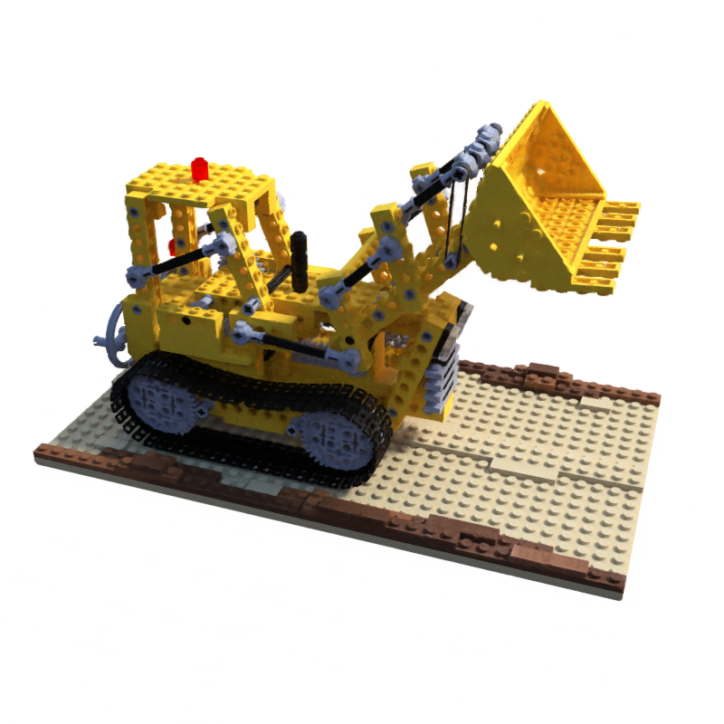

# Get Startup
1. Run train `python train-nerf.py --half-resolution`

# Run Demo
1. Run `python train-nerf.py --make-video360`
    - Produce a video with 360 degree rendering

# Demo

# Reference
1. https://github.com/bmild/nerf
2. https://github.com/yenchenlin/nerf-pytorch